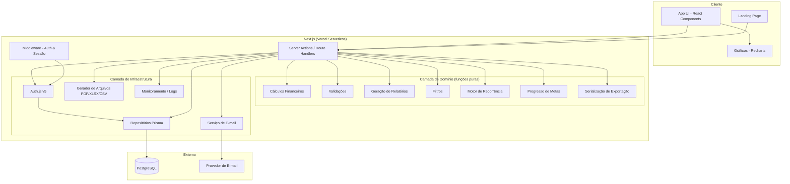
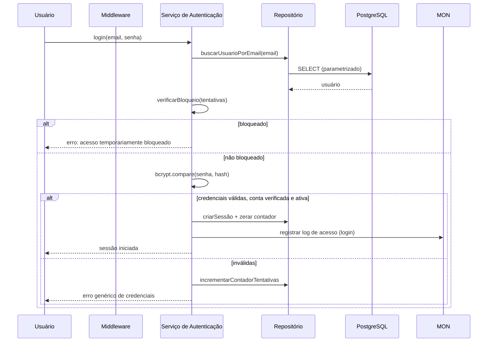
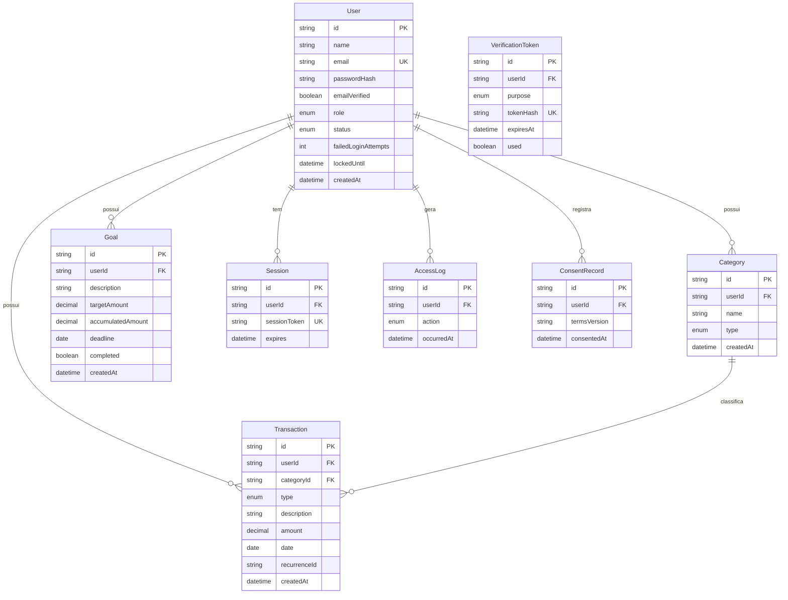

# Design Document

## Overview

A Plataforma Web de Gestão Financeira e Controle de Gastos é uma aplicação full-stack construída sobre Next.js (App Router), React e TypeScript, com Tailwind CSS na camada de apresentação, PostgreSQL como banco de dados relacional e Prisma ORM como camada de acesso a dados. A hospedagem-alvo é a Vercel, utilizando Serverless Functions para a camada de API, variáveis de ambiente seguras para segredos e CI/CD nativo via integração com GitHub.

O design separa a aplicação em três camadas lógicas claras:

1. **Camada de Apresentação (UI)** — React Server Components e Client Components renderizados pelo Next.js, responsável por layout responsivo, dashboard, formulários e gráficos.
2. **Camada de Aplicação (Serviços de Domínio)** — funções puras e serviços de domínio em TypeScript que implementam toda a lógica de negócio (cálculos financeiros, validações, geração de relatórios, filtros, regras de recorrência e metas). Esta camada é o foco principal dos testes baseados em propriedades, por ser composta majoritariamente de funções puras.
3. **Camada de Infraestrutura** — acesso a dados via Prisma, autenticação via Auth.js (NextAuth v5), envio de e-mail, geração de arquivos de exportação e logging/monitoramento.

A decisão central de arquitetura é isolar a **lógica de domínio pura** (cálculos, validações e transformações) da **lógica de I/O** (banco de dados, e-mail, sessão). Essa separação permite testar exaustivamente a corretude financeira sem dependências externas e mantém a camada de I/O fina e previsível.

O escopo é entregue em duas fases:

- **MVP**: autenticação (Req. 1–3), perfil (Req. 4), dashboard (Req. 5), receitas (Req. 6), despesas (Req. 7), categorias (Req. 8), relatórios básicos (Req. 10), responsividade (Req. 13), segurança base (Req. 16) e landing page (Req. 17).
- **Versão Completa**: metas financeiras (Req. 9), relatórios avançados e exportação (Req. 10–11), filtros e pesquisas (Req. 12), painel administrativo (Req. 14–15), conformidade LGPD completa e otimizações de desempenho (Req. 16).

### Premissas Tecnológicas e Pesquisa

As escolhas de bibliotecas foram validadas contra padrões atuais do ecossistema Next.js:

- **Autenticação**: Auth.js v5 (NextAuth) com `@auth/prisma-adapter` e estratégia de **sessão em banco de dados** (database sessions), que permite invalidação explícita de sessões — requisito crítico em Req. 2.4, 3.6 e 14.3. A configuração é dividida em `auth.config.ts` (edge-compatible, sem adapter) e `auth.ts` (configuração completa com adapter), padrão recomendado para compatibilidade com middleware. Fonte: [Auth.js v5 + Prisma App Router](https://github.com/wpcodevo/nextauth-nextjs15-prisma).
- **Hash de senha**: `bcrypt` com salt único por usuário (Req. 16.1). O `bcrypt` gera e embute um salt aleatório por hash, satisfazendo o requisito de salt único.
- **Validação**: Zod para validação de schema de entrada, compartilhada entre cliente e servidor (server actions).
- **Testes baseados em propriedades**: `fast-check` integrado ao `Vitest`. O `fast-check` é agnóstico ao runner de testes e suporta configuração de número de execuções via `numRuns`. Fonte: [fast-check global settings](https://fast-check.dev/docs/configuration/global-settings/).

*Conteúdo das fontes foi reescrito para conformidade com restrições de licenciamento.*

## Architecture

### Visão de Alto Nível



### Padrões Arquiteturais

- **Server Actions como fronteira de aplicação**: cada operação que altera estado (criar/editar/excluir lançamento, criar conta, alterar perfil) é implementada como Server Action ou Route Handler. A fronteira valida entrada (Zod), verifica autenticação/autorização e token anti-CSRF (Req. 16.3–16.4), e então delega para a camada de domínio pura.
- **Repositórios finos sobre Prisma**: o acesso a dados é encapsulado em módulos repositório (ex.: `transactionRepository`, `categoryRepository`). Prisma utiliza consultas parametrizadas por padrão, satisfazendo Req. 16.5.
- **Domínio puro**: os cálculos e validações nunca acessam I/O. Recebem dados já carregados e retornam resultados ou erros. Isso permite que as propriedades de corretude sejam testadas com dados gerados aleatoriamente, sem mocks de banco.
- **Middleware de proteção de rotas**: o middleware do Next.js verifica a presença de sessão válida e o papel (role) do usuário antes de servir rotas protegidas e rotas administrativas (Req. 2.7, 14.6, 15.6).

### Fluxo de Autenticação e Sessão



### Estratégia de Sessão e Expiração

Sessões são persistidas no banco (tabela `Session`) com `expires`. A expiração por inatividade de 30 minutos (Req. 2.5) é implementada como `maxAge` deslizante: cada requisição autenticada renova o `expires` para `now + 30min`. O middleware nega acesso a recursos protegidos quando `expires < now` (Req. 2.7). A invalidação explícita (logout, alteração de senha, desativação de conta) remove os registros de sessão correspondentes (Req. 2.4, 3.6, 14.3).

### Responsividade

A responsividade (Req. 13, 17.3–17.5) é implementada com Tailwind CSS usando breakpoints alinhados aos limiares dos requisitos:

| Faixa de largura | Layout | Breakpoint Tailwind |
|---|---|---|
| < 768px | Smartphone (toque mínimo 44×44px) | base / `sm` |
| 768–1023px | Tablet | `md` |
| ≥ 1024px | Desktop (navegação sempre visível) | `lg` |

Todas as funcionalidades permanecem operáveis a partir de 320px (Req. 13.4); nenhuma funcionalidade é ocultada por dispositivo. A adaptação ao redimensionamento é tratada por CSS responsivo nativo (media queries via Tailwind), garantindo aplicação do layout em menos de 1 segundo (Req. 13.5).

## Components and Interfaces

Os componentes correspondem aos serviços do glossário de requisitos. Cada serviço expõe uma interface de domínio pura mais um conjunto de operações de fronteira (server actions).

### Serviço de Autenticação (Req. 1, 2, 3, 14.5, 16.1)

Responsável por cadastro, login, sessão, recuperação e alteração de senha.

```typescript
// Validações puras (testáveis por propriedade)
function validateRegistration(input: RegistrationInput): ValidationResult<RegistrationData>;
function validateEmailFormat(email: string): boolean;
function validatePasswordLength(password: string): ValidationResult<void>; // 8..64
function isAccountLocked(state: LoginAttemptState, now: Date): boolean;
function nextLoginAttemptState(state: LoginAttemptState, success: boolean, now: Date): LoginAttemptState;
function isTokenValid(token: VerificationToken, now: Date): boolean; // uso único + expiração

// Fronteira (I/O)
async function register(input: RegistrationInput): Promise<Result<UserId>>;
async function login(email: string, password: string): Promise<Result<Session>>;
async function logout(sessionId: string): Promise<void>;
async function requestPasswordReset(email: string): Promise<void>; // resposta genérica
async function resetPassword(token: string, newPassword: string): Promise<Result<void>>;
async function changePassword(userId: string, current: string, next: string): Promise<Result<void>>;
async function verifyEmail(token: string): Promise<Result<void>>;
async function resendVerification(email: string): Promise<Result<void>>; // máx. 5 / 24h
```

Regras-chave:
- Token de verificação: uso único, expira em 24h (Req. 1.3–1.6); reenvio limitado a 5/24h (Req. 1.6).
- Token de redefinição: uso único, expira em 1h (Req. 3.1–3.3).
- Contador de tentativas: incrementa em credenciais inválidas (Req. 2.2), bloqueia por 15min após 5 falhas consecutivas (Req. 2.6, 2.8), zera em sucesso (Req. 2.9).
- Mensagens genéricas para não revelar existência de e-mail (Req. 2.2, 3.8).

### Serviço de Perfil (Req. 4)

```typescript
function validateProfileUpdate(input: ProfileInput): ValidationResult<ProfileData>; // nome 1..100
async function updateProfile(userId: string, input: ProfileInput): Promise<Result<Profile>>;
async function updateSettings(userId: string, settings: AccountSettings): Promise<Result<AccountSettings>>;
async function requestEmailChange(userId: string, newEmail: string): Promise<Result<void>>; // verificação 24h
async function confirmEmailChange(token: string): Promise<Result<void>>;
```

O e-mail principal só muda após confirmação do novo endereço (Req. 4.4–4.5); o e-mail atual é preservado até lá.

### Serviço de Lançamentos — Receitas e Despesas (Req. 6, 7)

Receitas e Despesas compartilham a mesma estrutura e regras, diferindo apenas pelo `type` (`INCOME` / `EXPENSE`). São implementados como um serviço de `Transaction` parametrizado pelo tipo.

```typescript
function validateTransaction(input: TransactionInput, type: TransactionType): ValidationResult<TransactionData>;
function validateAmount(amount: unknown): ValidationResult<number>; // 0,01 .. 999.999.999,99
function sortTransactionHistory(txs: Transaction[]): Transaction[]; // data desc, depois createdAt desc
function categoryMatchesType(category: Category, type: TransactionType, ownerId: string): boolean;

async function createTransaction(userId: string, type: TransactionType, input: TransactionInput): Promise<Result<Transaction>>;
async function updateTransaction(userId: string, id: string, input: TransactionInput): Promise<Result<Transaction>>;
async function deleteTransaction(userId: string, id: string): Promise<Result<void>>;
async function listTransactions(userId: string, type: TransactionType): Promise<Transaction[]>;
```

Validações de propriedade da conta (Req. 6.7, 7.7) e correspondência de tipo de categoria (Req. 6.9, 7.9) são verificadas na fronteira antes da persistência.

### Motor de Recorrência (Req. 6.5, 7.5)

Função pura que, dado um lançamento recorrente, gera a sequência de ocorrências.

```typescript
type Frequency = 'DAILY' | 'WEEKLY' | 'MONTHLY' | 'YEARLY';

function generateOccurrences(
  base: RecurringTransaction,
  endDate: Date | null
): Transaction[];
// Gera ocorrências a cada intervalo até endDate, ou por 12 meses a partir da data inicial se endDate for null.
```

### Serviço de Categorias (Req. 8)

```typescript
function validateCategoryName(name: string): ValidationResult<string>; // 1..60
function isDuplicateCategory(existing: Category[], name: string, type: TransactionType): boolean; // por conta + tipo
function availableCategoriesForType(categories: Category[], type: TransactionType): Category[];

async function createCategory(userId: string, input: CategoryInput): Promise<Result<Category>>;
async function updateCategory(userId: string, id: string, input: CategoryInput): Promise<Result<Category>>;
async function deleteCategory(userId: string, id: string): Promise<Result<void>>; // bloqueia se houver lançamentos
```

### Serviço de Metas (Req. 9)

```typescript
function validateGoal(input: GoalInput, now: Date): ValidationResult<GoalData>; // valor>0, prazo>now
function computeGoalProgress(accumulated: number, target: number): number; // 0..100, limitado a 100
function isGoalComplete(accumulated: number, target: number): boolean;

async function createGoal(userId: string, input: GoalInput): Promise<Result<Goal>>;
async function updateGoal(userId: string, id: string, input: GoalInput): Promise<Result<Goal>>;
async function deleteGoal(userId: string, id: string): Promise<Result<void>>;
```

### Serviço de Dashboard (Req. 5)

Composto por funções puras de cálculo financeiro que recebem listas de lançamentos e um período.

```typescript
type Period =
  | { kind: 'CURRENT_MONTH' }
  | { kind: 'PREVIOUS_MONTH' }
  | { kind: 'CURRENT_YEAR' }
  | { kind: 'CUSTOM'; start: Date; end: Date };

function computeCurrentBalance(txs: Transaction[], asOf: Date): Money; // soma receitas - soma despesas até hoje
function computeTotals(txs: Transaction[], period: Period): { income: Money; expense: Money };
function computeMonthlyResult(txs: Transaction[], month: Month): Money;
function computeSavingsRate(monthlyResult: Money, monthlyIncome: Money): number | 'UNAVAILABLE'; // indisponível se receita=0
function computeExpenseVariation(current: Money, previous: Money): number | 'UNAVAILABLE';
function topExpenseCategory(txs: Transaction[], month: Month): CategoryId | null;
function distributionByCategory(txs: Transaction[], period: Period, type: TransactionType): CategoryShare[]; // valor + percentual
```

O Saldo_Atual ignora o período selecionado e considera todos os lançamentos até a data corrente (Req. 5.1). O estado vazio retorna zeros e orientação (Req. 5.6).

### Serviço de Relatórios (Req. 10) e Exportação (Req. 11)

```typescript
function buildIncomeReport(txs: Transaction[], start: Date, end: Date): Report;
function buildExpenseReport(txs: Transaction[], start: Date, end: Date): Report;
function buildMonthlyComparison(txs: Transaction[], start: Date, end: Date): MonthlyComparisonRow[];
function buildAnnualComparison(txs: Transaction[], start: Date, end: Date): AnnualComparisonRow[];
function buildCashFlow(txs: Transaction[], start: Date, end: Date): CashFlowRow[]; // saldo acumulado
function validatePeriod(start: Date | null, end: Date | null): ValidationResult<DateRange>; // ambos presentes, start<=end

// Exportação: serialização determinística do mesmo Report
function toCSV(report: Report): string;
function toXLSX(report: Report): Buffer;
function toPDF(report: Report): Buffer;

async function exportReport(report: Report, formats: ExportFormat[]): Promise<ExportResult[]>; // cada formato independente
```

A exportação preserva o mesmo conteúdo do relatório (Req. 11.1–11.3); relatórios vazios geram arquivo apenas com cabeçalhos (Req. 11.4); múltiplos formatos são independentes (Req. 11.5–11.6).

### Serviço de Filtros (Req. 12)

```typescript
type TransactionFilter = {
  description?: string;     // 1..100, parcial, case-insensitive
  categoryId?: string;
  period?: DateRange;       // inclusivo
  type?: TransactionType;
};

function applyFilters(txs: Transaction[], filter: TransactionFilter): Transaction[]; // AND de todos + ordenado por data desc
```

### Painel Administrativo (Req. 14) e Monitoramento (Req. 15)

```typescript
function canDeactivate(actor: AdminUser, target: User): boolean; // admin não desativa a si mesmo
function defaultMonitoringPeriod(now: Date): DateRange; // últimos 30 dias
function computeUsageStats(logs: AccessLog[], txs: Transaction[], period: DateRange): UsageStats; // usuários ativos, volume de lançamentos
function sortAccessLogs(logs: AccessLog[]): AccessLog[]; // data/hora desc

async function listUsers(admin: AdminUser): Promise<UserSummary[]>;
async function setUserActive(admin: AdminUser, userId: string, active: boolean): Promise<Result<void>>;
async function getAccessLogs(admin: AdminUser, period?: DateRange): Promise<AccessLog[]>;
```

A desativação de conta invalida todas as sessões do usuário (Req. 14.3) e impede login (Req. 14.5).

### Camada de Segurança Transversal (Req. 16)

- **Sanitização XSS** (Req. 16.2): toda entrada de usuário é sanitizada na escrita e a saída é escapada pelo React por padrão; campos de texto livre passam por sanitização (`sanitizeUserInput`) que neutraliza conteúdo de script.
- **Anti-CSRF** (Req. 16.3–16.4): operações que alteram estado exigem token anti-CSRF vinculado à sessão.
- **SQL parametrizado** (Req. 16.5): garantido pelo Prisma.
- **LGPD** (Req. 16.6, 16.9–16.10): exclusão/anonimização de dados em até 15 dias; registro de consentimento com data, hora e versão; bloqueio de cadastro sem consentimento.
- **Backups** (Req. 16.7–16.8): rotina de backup ≤ 24h, retenção ≥ 30 dias, com notificação em falha.

## Data Models

### Modelo Entidade-Relacionamento



### Tipos de Domínio (TypeScript)

```typescript
type TransactionType = 'INCOME' | 'EXPENSE';
type UserRole = 'USER' | 'ADMIN';
type AccountStatus = 'ACTIVE' | 'INACTIVE';
type Frequency = 'DAILY' | 'WEEKLY' | 'MONTHLY' | 'YEARLY';
type TokenPurpose = 'EMAIL_VERIFICATION' | 'PASSWORD_RESET' | 'EMAIL_CHANGE';
type AccessAction = 'LOGIN' | 'LOGOUT' | 'SESSION_EXPIRED';

// Money: valor monetário representado como inteiro de centavos para evitar erros de ponto flutuante.
type Money = number; // centavos (inteiro)

interface Transaction {
  id: string;
  userId: string;
  categoryId: string;
  type: TransactionType;
  description: string;   // 1..200
  amount: Money;         // 1 .. 99_999_999_999 centavos (0,01 .. 999.999.999,99)
  date: Date;
  recurrenceId: string | null;
  createdAt: Date;
}

interface Category {
  id: string;
  userId: string;
  name: string;          // 1..60
  type: TransactionType;
  createdAt: Date;
}

interface Goal {
  id: string;
  userId: string;
  description: string;   // 1..100
  targetAmount: Money;   // > 0
  accumulatedAmount: Money;
  deadline: Date;        // > now no cadastro
  completed: boolean;
  createdAt: Date;
}
```

### Decisões de Modelagem

- **Valores monetários como centavos inteiros**: para evitar imprecisão de ponto flutuante em cálculos financeiros, valores são armazenados como `Decimal` no PostgreSQL (via Prisma `Decimal`) e manipulados como inteiros de centavos (`Money`) na camada de domínio. A conversão ocorre nas bordas da aplicação. Isso torna soma, subtração e comparação exatas e determinísticas — essencial para as propriedades de corretude financeira.
- **Lançamentos unificados**: Receitas e Despesas compartilham a tabela `Transaction` discriminada por `type`, reduzindo duplicação e garantindo regras de validação idênticas (Req. 6 e 7 são espelhadas).
- **Recorrência materializada**: ocorrências de lançamentos recorrentes são geradas e persistidas como `Transaction` individuais com um `recurrenceId` compartilhado, permitindo que históricos, relatórios e filtros tratem todas as ocorrências uniformemente.
- **Tokens com hash**: tokens de verificação/redefinição são armazenados como hash, com `expiresAt` e flag `used` para garantir uso único (Req. 1.3, 3.2–3.3).
- **Bloqueio de login no modelo de usuário**: `failedLoginAttempts` e `lockedUntil` mantêm o estado de bloqueio (Req. 2.6, 2.8, 2.9).

## Correctness Properties

*Uma propriedade é uma característica ou comportamento que deve ser verdadeiro em todas as execuções válidas de um sistema — essencialmente, uma afirmação formal sobre o que o sistema deve fazer. Propriedades servem como a ponte entre especificações legíveis por humanos e garantias de corretude verificáveis por máquina.*

As propriedades abaixo focam na camada de domínio pura (cálculos financeiros, validações, transformações, ordenações e serialização). Critérios de UI, infraestrutura (backup, SQL parametrizado), envio de e-mail e desempenho são tratados por testes de exemplo, snapshot, integração ou smoke, conforme a Testing Strategy. As propriedades já passaram por reflexão de redundância: critérios espelhados de Receita/Despesa são cobertos por propriedades parametrizadas pelo tipo de lançamento, e validações de fronteira repetidas foram consolidadas.

### Property 1: Validação de comprimento de senha

*Para qualquer* string de senha, a validação de cadastro a aceita se e somente se seu comprimento estiver entre 8 e 64 caracteres inclusive, e a validação de alteração/redefinição a aceita se e somente se tiver no mínimo 8 caracteres.

**Validates: Requirements 1.5, 3.2, 3.4, 3.7**

### Property 2: Validade de token de uso único

*Para qualquer* token de verificação ou redefinição, ele é considerado válido se e somente se não tiver sido usado e o instante atual for anterior à sua expiração (24h para verificação de e-mail, 1h para redefinição de senha); após um uso bem-sucedido, o mesmo token nunca é aceito novamente.

**Validates: Requirements 1.3, 1.4, 1.6, 3.1, 3.2, 3.3**

### Property 3: Limite de reenvio de e-mail de validação

*Para qualquer* sequência de solicitações de reenvio do e-mail de validação dentro de uma janela de 24 horas, a plataforma aceita no máximo 5 reenvios e rejeita qualquer solicitação adicional na mesma janela.

**Validates: Requirements 1.6**

### Property 4: Unicidade de e-mail no cadastro

*Para qualquer* conjunto de usuários existentes e qualquer entrada de cadastro, a criação de conta é rejeitada se e somente se o e-mail informado (normalizado) já estiver associado a uma conta existente; caso contrário, é aceita e nunca produz dois usuários com o mesmo e-mail.

**Validates: Requirements 1.1, 1.2**

### Property 5: Decisão de autenticação

*Para qualquer* estado de usuário e par de credenciais, a autenticação é bem-sucedida se e somente se a senha conferir com o hash armazenado, o e-mail estiver verificado, a conta estiver ativa e o e-mail não estiver bloqueado; em qualquer outro caso a autenticação é rejeitada e nenhuma sessão é iniciada.

**Validates: Requirements 2.1, 2.3, 14.5**

### Property 6: Máquina de estado de tentativas de login

*Para qualquer* estado de tentativas e sequência de resultados de login, uma falha incrementa o contador em exatamente 1, 5 falhas consecutivas sem sucesso intermediário acionam um bloqueio de 15 minutos durante o qual toda tentativa é rejeitada mesmo com credenciais corretas, e qualquer autenticação bem-sucedida zera o contador.

**Validates: Requirements 2.2, 2.6, 2.8, 2.9**

### Property 7: Validade e expiração de sessão por inatividade

*Para qualquer* sessão e instante atual, o acesso a um recurso protegido é concedido se e somente se a sessão existir e o tempo de inatividade desde a última requisição for inferior a 30 minutos; sessões expiradas ou inexistentes sempre resultam em acesso negado.

**Validates: Requirements 2.5, 2.7**

### Property 8: Invalidação de sessões por evento de segurança

*Para qualquer* usuário com um conjunto de sessões ativas, após alterar/redefinir sua senha ou ter sua conta desativada, o conjunto de sessões ativas desse usuário fica vazio.

**Validates: Requirements 3.6, 14.3**

### Property 9: Resposta genérica de recuperação de senha

*Para qualquer* e-mail informado em uma solicitação de recuperação de senha, a resposta apresentada ao solicitante é idêntica, independentemente de o e-mail estar ou não cadastrado.

**Validates: Requirements 3.8**

### Property 10: Validação e fluxo de alteração de e-mail de perfil

*Para qualquer* solicitação de alteração de e-mail, o e-mail principal da conta permanece inalterado até que o token de verificação do novo e-mail seja confirmado dentro do prazo; após a confirmação válida, o e-mail principal passa a ser o novo endereço.

**Validates: Requirements 4.4, 4.5**

### Property 11: Validação de nome de perfil

*Para qualquer* entrada de atualização de perfil, a alteração é aceita se e somente se o campo nome estiver preenchido e tiver entre 1 e 100 caracteres; caso contrário é rejeitada e os dados atuais permanecem inalterados.

**Validates: Requirements 4.1, 4.3**

### Property 12: Saldo atual independe do período

*Para qualquer* conjunto de lançamentos de um usuário, o Saldo_Atual é igual ao somatório de todas as receitas menos o somatório de todas as despesas registradas até a data corrente, e seu valor não muda em função do período selecionado no dashboard.

**Validates: Requirements 5.1**

### Property 13: Totais e resultado mensal por período

*Para qualquer* conjunto de lançamentos e período selecionado, o total de receitas e o total de despesas consideram exatamente os lançamentos do respectivo tipo cuja data pertence ao período, e o Resultado_Mensal do mês corrente é igual ao total de receitas menos o total de despesas desse mês.

**Validates: Requirements 5.2, 5.3**

### Property 14: Distribuição por categoria

*Para qualquer* conjunto de lançamentos de um tipo com total positivo em um período, o valor de cada fatia da distribuição é igual à soma dos lançamentos daquela categoria no período, e a soma dos percentuais de todas as categoria daquele tipo é igual a 100%.

**Validates: Requirements 5.4**

### Property 15: Indicadores financeiros do mês

*Para qualquer* conjunto de lançamentos do mês corrente e do mês anterior, a taxa de economia é igual a Resultado_Mensal dividido pelo total de receitas do mês (ou indisponível quando esse total é zero), a variação de despesas é igual a (despesas do mês − despesas do mês anterior) dividido pelas despesas do mês anterior, e a categoria de maior despesa é aquela com maior valor acumulado no mês.

**Validates: Requirements 5.5, 5.8**

### Property 16: Validação de valor e campos de lançamento

*Para qualquer* entrada de lançamento e tipo (Receita ou Despesa), a validação é aceita se e somente se a descrição tiver de 1 a 200 caracteres, o valor for numérico e estiver entre 0,01 e 999.999.999,99, a data for uma data de calendário válida e a categoria estiver informada; caso contrário é rejeitada preservando os dados informados.

**Validates: Requirements 6.1, 6.2, 6.4, 6.8, 7.1, 7.2, 7.4, 7.8**

### Property 17: Categoria deve corresponder ao tipo e ao dono

*Para qualquer* lançamento e categoria, a operação é aceita se e somente se a categoria pertencer ao mesmo usuário e seu tipo for igual ao tipo do lançamento; categoria de outro usuário ou de tipo divergente sempre resulta em rejeição.

**Validates: Requirements 6.9, 7.9, 8.7**

### Property 18: Ordenação de histórico de lançamentos

*Para qualquer* lista de lançamentos de um usuário, o histórico retornado é uma permutação da entrada ordenada de forma decrescente por data e, em caso de datas iguais, de forma decrescente por data de criação.

**Validates: Requirements 6.6, 7.6**

### Property 19: Autorização por proprietário

*Para qualquer* recurso (lançamento, categoria ou meta) e usuário, uma operação de edição ou exclusão é autorizada se e somente se o usuário for o proprietário do recurso; tentativas sobre recursos de outro usuário são rejeitadas e o recurso permanece inalterado.

**Validates: Requirements 6.7, 7.7, 8.9, 9.9**

### Property 20: Round-trip de exclusão de lançamento

*Para qualquer* lançamento de um usuário, após a exclusão bem-sucedida ele não aparece mais na listagem do usuário, e a exclusão não afeta os demais lançamentos.

**Validates: Requirements 6.3, 7.3**

### Property 21: Geração de ocorrências recorrentes

*Para qualquer* lançamento recorrente com frequência diária, semanal, mensal ou anual, as ocorrências geradas estão espaçadas exatamente pelo intervalo da frequência, todas têm data menor ou igual à data de término informada (ou dentro dos 12 meses seguintes à data inicial quando não há término) e a primeira ocorrência coincide com a data inicial.

**Validates: Requirements 6.5, 7.5**

### Property 22: Validação de nome de categoria

*Para qualquer* entrada de criação ou edição de categoria, a operação relativa ao nome é aceita se e somente se o nome não for vazio e tiver entre 1 e 60 caracteres.

**Validates: Requirements 8.1, 8.3, 8.8**

### Property 23: Unicidade de categoria por conta e tipo

*Para qualquer* conjunto de categorias de um usuário, criar ou editar uma categoria é rejeitado se e somente se já existir, na mesma conta e com o mesmo tipo, uma categoria com o mesmo nome.

**Validates: Requirements 8.6**

### Property 24: Exclusão de categoria condicionada a lançamentos

*Para qualquer* categoria de um usuário e conjunto de lançamentos, a exclusão da categoria é permitida se e somente se nenhum lançamento referenciar essa categoria; caso contrário é rejeitada e a categoria é preservada.

**Validates: Requirements 8.4, 8.5**

### Property 25: Validação de meta financeira

*Para qualquer* entrada de cadastro de meta e instante atual, a meta é aceita se e somente se a descrição tiver de 1 a 100 caracteres, o valor-alvo estiver entre 0,01 e 999.999.999,99 e o prazo for posterior à data atual; metas aceitas iniciam com progresso 0%.

**Validates: Requirements 9.1, 9.5, 9.6, 9.7**

### Property 26: Progresso e conclusão de meta

*Para qualquer* valor acumulado e valor-alvo positivo, o progresso é igual a min(100, 100 × acumulado ÷ alvo), permanece sempre no intervalo de 0% a 100%, e a meta é marcada como concluída se e somente se o acumulado for maior ou igual ao valor-alvo.

**Validates: Requirements 9.2, 9.4**

### Property 27: Relatório por intervalo de datas

*Para qualquer* conjunto de lançamentos, tipo e intervalo válido, o relatório contém exatamente os lançamentos do próprio usuário, do tipo solicitado, cuja data pertence ao intervalo fechado [data inicial, data final]; nenhum lançamento fora do intervalo, de outro tipo ou de outro usuário é incluído.

**Validates: Requirements 10.1, 10.2**

### Property 28: Conservação de soma nos comparativos

*Para qualquer* conjunto de lançamentos e intervalo, o comparativo (mensal ou anual) cria exatamente um agrupamento por mês civil ou ano civil do intervalo, e a soma dos totais de receitas (e de despesas) de todos os agrupamentos é igual ao total de receitas (e de despesas) do intervalo completo.

**Validates: Requirements 10.3, 10.4**

### Property 29: Saldo acumulado no fluxo de caixa

*Para qualquer* conjunto de lançamentos e intervalo, em cada ponto do relatório de fluxo de caixa o saldo acumulado é igual à soma das entradas menos a soma das saídas até aquele ponto, e o saldo acumulado final é igual ao total de entradas menos o total de saídas do intervalo.

**Validates: Requirements 10.5**

### Property 30: Validação de período de relatório

*Para qualquer* par de datas, a solicitação de relatório é aceita se e somente se ambas as datas (inicial e final) estiverem presentes e a data inicial for menor ou igual à data final; caso contrário é rejeitada.

**Validates: Requirements 10.6, 10.7**

### Property 31: Round-trip de serialização CSV

*Para qualquer* relatório, serializar para CSV e em seguida analisar (parse) o CSV recupera os mesmos cabeçalhos e as mesmas linhas de dados do relatório original; um relatório sem linhas produz um CSV contendo apenas os cabeçalhos.

**Validates: Requirements 11.3, 11.4**

### Property 32: Independência entre formatos de exportação

*Para qualquer* conjunto de formatos solicitados simultaneamente, cada formato é gerado de forma independente e reporta seu próprio resultado (sucesso com arquivo disponível ou falha), de modo que a falha de um formato não impede a geração nem altera o resultado dos demais.

**Validates: Requirements 11.5, 11.6**

### Property 33: Aplicação conjunta de filtros

*Para qualquer* conjunto de lançamentos de um usuário e qualquer combinação de filtros (descrição parcial sem diferenciação de caixa, categoria, período inclusivo e tipo), o resultado contém exatamente os lançamentos do próprio usuário que satisfazem simultaneamente todos os filtros aplicados, sem incluir nenhum não-correspondente nem omitir nenhum correspondente.

**Validates: Requirements 12.1, 12.2, 12.3, 12.4, 12.5**

### Property 34: Ordenação dos resultados de filtro

*Para qualquer* conjunto de lançamentos e filtros, os resultados retornados são ordenados de forma decrescente por data.

**Validates: Requirements 12.8**

### Property 35: Autorização de acesso por papel de administrador

*Para qualquer* usuário, o acesso ao Painel_Administrativo e ao monitoramento é concedido se e somente se o usuário tiver papel de Administrador; usuários sem privilégios sempre recebem acesso negado, sem exposição de dados.

**Validates: Requirements 14.6, 15.6**

### Property 36: Administrador não desativa a própria conta

*Para qualquer* administrador, uma solicitação de desativação é rejeitada se e somente se o alvo for a própria conta do administrador; desativar a conta de outro usuário é permitido.

**Validates: Requirements 14.7**

### Property 37: Ordenação de logs de acesso

*Para qualquer* conjunto de logs de acesso, a listagem retornada é uma permutação da entrada ordenada de forma decrescente por data e hora do evento.

**Validates: Requirements 15.2**

### Property 38: Estatísticas de uso por período

*Para qualquer* conjunto de logs de acesso, lançamentos e período, o número de usuários ativos é igual à quantidade de usuários distintos que iniciaram pelo menos uma sessão no período, e o volume de lançamentos é igual à quantidade de lançamentos cuja data pertence ao período.

**Validates: Requirements 15.3**

### Property 39: Armazenamento seguro de senha com salt único

*Para qualquer* senha, o valor armazenado nunca é igual à senha em texto puro, a verificação do hash contra a senha original é bem-sucedida, e duas contas que utilizem a mesma senha produzem hashes distintos (salt único por usuário).

**Validates: Requirements 16.1**

### Property 40: Sanitização de entrada contra XSS

*Para qualquer* entrada de usuário, o conteúdo sanitizado não contém scripts executáveis, e aplicar a sanitização novamente sobre uma entrada já sanitizada produz o mesmo resultado (idempotência).

**Validates: Requirements 16.2**

### Property 41: Validação de token anti-CSRF

*Para qualquer* requisição que altera estado, a operação é executada se e somente se acompanhar um token anti-CSRF presente, válido e vinculado à sessão atual; token ausente, inválido ou expirado sempre resulta em rejeição sem alteração de estado.

**Validates: Requirements 16.3, 16.4**

### Property 42: Consentimento obrigatório no cadastro

*Para qualquer* tentativa de cadastro, a conclusão é permitida se e somente se o consentimento ao tratamento de dados pessoais for fornecido; sem consentimento, o cadastro é bloqueado.

**Validates: Requirements 16.10**

## Error Handling

A estratégia de tratamento de erros distingue erros de validação (esperados, vinculados à entrada do usuário) de erros de infraestrutura (inesperados, vinculados a I/O).

### Modelo de Resultado

A camada de domínio e de aplicação usa um tipo `Result<T>` discriminado em vez de exceções para erros esperados:

```typescript
type Result<T> =
  | { ok: true; value: T }
  | { ok: false; error: AppError };

interface AppError {
  code: ErrorCode;
  field?: string;        // campo associado a erro de validação
  message: string;       // mensagem segura para exibição
}

type ErrorCode =
  | 'VALIDATION'         // entrada inválida (400)
  | 'UNAUTHORIZED'       // sessão ausente/expirada (401)
  | 'FORBIDDEN'          // sem permissão / não é dono / CSRF (403)
  | 'NOT_FOUND'          // recurso inexistente (404)
  | 'CONFLICT'           // duplicidade (e-mail, categoria) (409)
  | 'LOCKED'             // login bloqueado / conta inativa (423)
  | 'RATE_LIMITED'       // limite de reenvio (429)
  | 'INTERNAL';          // falha de infraestrutura (500)
```

### Diretrizes por Categoria

| Situação | Código | Comportamento |
|---|---|---|
| Validação de entrada falha (Req. 1.5, 4.3, 6.4, 8.8, 9.5, 10.6) | `VALIDATION` | Rejeitar, indicar campo e critério, preservar dados informados |
| Sessão expirada/inválida (Req. 2.7) | `UNAUTHORIZED` | Negar acesso, exigir nova autenticação |
| Não-proprietário / não-admin / CSRF (Req. 6.7, 14.6, 16.4) | `FORBIDDEN` | Negar, não expor dados, não alterar estado |
| E-mail/categoria duplicada (Req. 1.2, 8.6) | `CONFLICT` | Rejeitar, informar duplicidade |
| Login bloqueado / conta inativa (Req. 2.8, 14.5) | `LOCKED` | Mensagem de bloqueio/inatividade sem revelar credenciais |
| Limite de reenvio (Req. 1.6) | `RATE_LIMITED` | Rejeitar reenvio adicional na janela |
| Falha ao carregar dashboard (Req. 5.7) | `INTERNAL` | Mensagem de indisponibilidade temporária, preservar lançamentos, opção de recarregar |
| Falha de exportação (Req. 11.6) | `INTERNAL` | Não disponibilizar arquivo parcial, preservar dados de origem, reportar falha por formato |
| Falha de envio de e-mail (Req. 1.8) | `INTERNAL` | Preservar conta não-verificada, disponibilizar reenvio |

### Princípios de Segurança no Tratamento de Erros

- **Mensagens não-reveladoras**: erros de autenticação e recuperação de senha usam mensagens genéricas (Req. 2.2, 3.8) para não vazar a existência de contas.
- **Falha fechada**: na dúvida sobre autorização (sessão, papel, CSRF), o padrão é negar o acesso.
- **Atomicidade**: operações que alteram estado só persistem após validação completa; falhas não deixam estado parcial (Req. 11.6).
- **Preservação de dados**: nenhum erro de validação ou de I/O apaga dados já existentes do usuário (Req. 5.7, 6.4, 11.6).

## Testing Strategy

A estratégia combina testes baseados em propriedades (para a lógica de domínio pura), testes de exemplo/unitários (para casos concretos e edge cases), testes de snapshot (para UI/responsividade) e testes de integração/smoke (para I/O e infraestrutura).

### Ferramentas

- **Runner**: Vitest (TypeScript, integrado ao ecossistema Vite/Next.js).
- **Property-based testing**: `fast-check`, integrado ao Vitest. O `fast-check` é agnóstico ao runner e permite configurar o número de execuções via `numRuns`. Não implementaremos PBT do zero.
- **UI**: React Testing Library + snapshots; testes de viewport para responsividade.
- **Mocks de I/O**: repositórios Prisma e serviço de e-mail são mockados para testar a fronteira de aplicação sem banco real.

### Testes Baseados em Propriedades

- Cada propriedade da seção Correctness Properties é implementada por **um único teste de propriedade**.
- Cada teste de propriedade roda **no mínimo 100 iterações** (`fc.assert(fc.property(...), { numRuns: 100 })` ou configuração global equivalente).
- Cada teste de propriedade é anotado com um comentário referenciando a propriedade do design, no formato:
  **Feature: financial-management-platform, Property {número}: {texto da propriedade}**
- Geradores (`arbitraries`) personalizados produzem entidades de domínio válidas e inválidas: lançamentos (com valores em centavos, datas variadas, descrições de 0 a 200+ caracteres, incluindo Unicode), categorias, metas, sessões com tempos variados, tokens (válidos/expirados/usados), e payloads de entrada com conteúdo de script para a propriedade de XSS.
- Os geradores incluem deliberadamente casos de fronteira (listas vazias, valores nos limites 0,01 e 999.999.999,99, strings de whitespace, datas iguais para testar desempate de ordenação) para que os edge cases identificados na prework sejam cobertos pelas próprias propriedades.

### Mapeamento de Propriedades para Testes

| Propriedades | Módulo sob teste | Tipo de geração |
|---|---|---|
| 1, 11, 16, 22, 25, 30, 42 | Validações puras | Entradas válidas/inválidas de fronteira |
| 2, 3, 5, 6, 7, 8, 9, 39, 41 | Autenticação/sessão/segurança | Estados de usuário, tokens, sessões, senhas |
| 4, 10 | Cadastro/perfil | Conjuntos de usuários + e-mails |
| 12, 13, 14, 15 | Cálculos de dashboard | Conjuntos de lançamentos + períodos |
| 17, 18, 19, 20, 21 | Lançamentos (Receita/Despesa) | Lançamentos parametrizados por tipo |
| 23, 24 | Categorias | Categorias + lançamentos |
| 26 | Metas | Pares acumulado/alvo |
| 27, 28, 29, 31, 32 | Relatórios/exportação | Lançamentos + intervalos + formatos |
| 33, 34 | Filtros | Lançamentos + combinações de filtros |
| 35, 36, 37, 38 | Administração/monitoramento | Usuários, logs, períodos |
| 40 | Sanitização XSS | Strings com payloads de script |

### Testes de Exemplo e Unitários

Focados em casos concretos e edge cases que complementam as propriedades:
- Estado vazio do dashboard com orientação ao primeiro lançamento (Req. 5.6).
- Classificação exclusiva de categoria como Receita ou Despesa (Req. 8.2).
- Reativação de conta permite novo login (Req. 14.4); login de conta inativa rejeitado (Req. 14.5).
- Registro de consentimento com data, hora e versão (Req. 16.9).
- Conteúdo da landing page: proposta de valor + ≥3 funcionalidades e CTA de cadastro (Req. 17.1, 17.2).
- Período padrão de monitoramento de 30 dias (Req. 15.4) e listas vazias (Req. 15.5).

### Testes de Snapshot / Responsividade

- Layouts desktop (≥1024px), tablet (768–1023px) e smartphone (<768px) para a aplicação e a landing page (Req. 13.1–13.3, 13.5, 17.3–17.5).
- Verificação de área de toque mínima de 44×44px em smartphone (Req. 13.3) e operabilidade a partir de 320px (Req. 13.4).
- Indicador visual de progresso de meta refletindo o percentual calculado (Req. 9.3).

### Testes de Integração e Smoke

Para comportamentos de I/O e infraestrutura, onde a variação de entrada não agrega valor (não são candidatos a PBT):
- Geração de exportação PDF e XLSX com conteúdo correto e dentro de 30s (Req. 11.1, 11.2) — 1–2 exemplos representativos.
- Falha de envio de e-mail preservando conta não-verificada (Req. 1.8).
- Falha de carregamento do dashboard preservando dados (Req. 5.7).
- Falha de backup com log + notificação + preservação do último backup (Req. 16.8).
- Smoke: uso de consultas parametrizadas via Prisma (Req. 16.5); agendamento de backup ≤24h e retenção ≥30 dias (Req. 16.7).
- Anonimização/exclusão de dados pessoais sem PII recuperável (Req. 16.6).
- Registro de logs de acesso em login/logout/expiração com a estrutura exigida (Req. 15.1).

### Justificativa para Exclusões de PBT

Os seguintes critérios não são adequados a testes baseados em propriedades e usam estratégias alternativas: responsividade e landing page (renderização/CSS → snapshot/visual), exportação binária PDF/XLSX e envio de e-mail (I/O/side-effect → integração/mock), SQL parametrizado e backup (infraestrutura/configuração → smoke), e desempenho/prazos (≤30s, ≤1s, ≤15 dias → testes de desempenho/operacionais, não propriedades funcionais).
